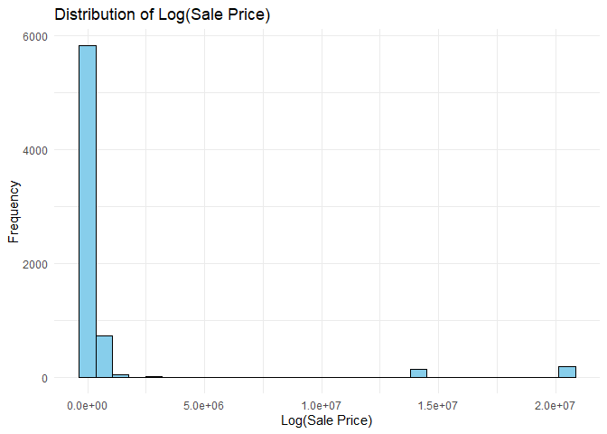
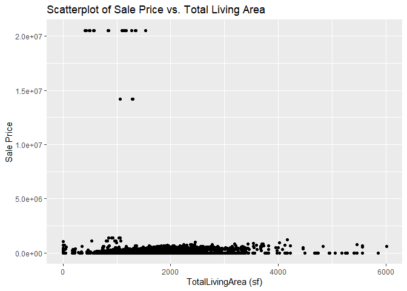
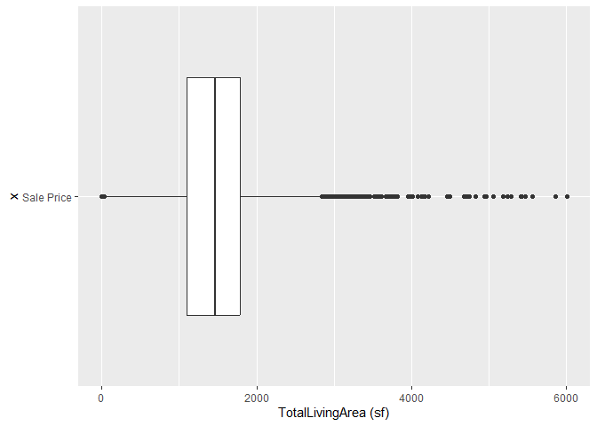

<!-- README.md is generated from README.Rmd. Please edit the README.Rmd file -->

# Lab report \#1

Follow the instructions posted at
<https://ds202-at-isu.github.io/labs.html> for the lab assignment. The
work is meant to be finished during the lab time, but you have time
until Monday evening to polish things.

Include your answers in this document (Rmd file). Make sure that it
knits properly (into the md file). Upload both the Rmd and the md file
to your repository.

All submissions to the github repo will be automatically uploaded for
grading once the due date is passed. Submit a link to your repository on
Canvas (only one submission per team) to signal to the instructors that
you are done with your submission.

\<\<\<\<\<\<\< HEAD \<\<\<\<\<\<\< HEAD \<\<\<\<\<\<\< HEAD =======
\>\>\>\>\>\>\> 4aec923a397186abcfb3323cfbff9642c7a0d504

``` r
library(classdata)
df = ames
str(ames)
```

    ## Classes 'tbl_df', 'tbl' and 'data.frame':    6935 obs. of  16 variables:
    ##  $ Parcel ID            : chr  "0903202160" "0907428215" "0909428070" "0923203160" ...
    ##  $ Address              : chr  "1024 RIDGEWOOD AVE, AMES" "4503 TWAIN CIR UNIT 105, AMES" "2030 MCCARTHY RD, AMES" "3404 EMERALD DR, AMES" ...
    ##  $ Style                : Factor w/ 12 levels "1 1/2 Story Brick",..: 2 5 5 5 NA 9 5 5 5 5 ...
    ##  $ Occupancy            : Factor w/ 5 levels "Condominium",..: 2 1 2 3 NA 2 2 1 2 2 ...
    ##  $ Sale Date            : Date, format: "2022-08-12" "2022-08-04" ...
    ##  $ Sale Price           : num  181900 127100 0 245000 449664 ...
    ##  $ Multi Sale           : chr  NA NA NA NA ...
    ##  $ YearBuilt            : num  1940 2006 1951 1997 NA ...
    ##  $ Acres                : num  0.109 0.027 0.321 0.103 0.287 0.494 0.172 0.023 0.285 0.172 ...
    ##  $ TotalLivingArea (sf) : num  1030 771 1456 1289 NA ...
    ##  $ Bedrooms             : num  2 1 3 4 NA 4 5 1 3 4 ...
    ##  $ FinishedBsmtArea (sf): num  NA NA 1261 890 NA ...
    ##  $ LotArea(sf)          : num  4740 1181 14000 4500 12493 ...
    ##  $ AC                   : chr  "Yes" "Yes" "Yes" "Yes" ...
    ##  $ FirePlace            : chr  "Yes" "No" "No" "No" ...
    ##  $ Neighborhood         : Factor w/ 42 levels "(0) None","(13) Apts: Campus",..: 15 40 19 18 6 24 14 40 13 23 ...

1.  We have the following variables - Parcel ID - Character (House ID)
    Address - Character (Address of hosue in ames) Style - Factor
    (Dimensions and stuff) Occupancy - factor (Occupies or free) Sale
    Date - Date (Date of sale) Sale Price - Numeric (Price sold at)
    Multi Sale - charater (if sold multiple times) YearBuilt - Numeric
    (Year built in) Acres - Numeric (Area of property) TotalLivingArea -
    Numeric (Living Area of property) Bedrooms - Numeric (total bedrooms
    in house) FinishedBsmtArea - Numeric (FInsihed basement work)
    LotArea - Numeric (Area of total parking lot) AC - character (If ac
    is present or not) FirePlace - character (Fireplace present or not)
    Neighborhoor - Factor (neighborhood located in)

We expect their data range to be generally between their highest and
lowest values. For AC,Fireplace we can have NA or Present.

# \<\<\<\<\<\<\< HEAD

======= \>\>\>\>\>\>\> 4aec923a397186abcfb3323cfbff9642c7a0d504

2.  is there a variable of special focus?

- the variables we want to look at are Sale Price and TotalLivingArea
  (sf)

Both are numeric variables \<\<\<\<\<\<\< HEAD

Sale price is the main variable and total living area is the variable
that might be related

# \#Step Three

\#Step Three \>\>\>\>\>\>\> 35ed1ec6b32361c60c078eddc0666aede76999c1
======= \>\>\>\>\>\>\> 4aec923a397186abcfb3323cfbff9642c7a0d504

P \>\>\>\>\>\>\> c925fe450723b846485fb6ad26fb09d56e3b7678

``` r
library(ggplot2)
range(ames$`Sale Price`)
```

    ## [1]        0 20500000

``` r
ggplot(ames, aes(x = log(`Sale Price`))) +
  geom_histogram(binwidth = 0.1, fill = "skyblue", color = "black") +
  labs(x = "Log(Sale Price)", y = "Frequency", title = "Distribution of Log(Sale Price)") +
  theme_minimal()
```

    ## Warning: Removed 2206 rows containing non-finite values (`stat_bin()`).

<!-- -->
\<\<\<\<\<\<\< HEAD

library(ggplot2)

``` r
ggplot(ames, aes(x = 'TotalLivingArea (sf)', y = 'Sale Price')) +
  geom_point() +
  labs(x = "TotalLivingArea (sf)", y = "Sale Price", title = "Scatterplot of Sale Price vs. Total Living Area")
```

<!-- -->

\#Step Four

``` r
cleaned_data <- na.omit(ames$`TotalLivingArea (sf)`)

range_var <- range(cleaned_data)
print(range_var)
```

    ## [1]    0 6007

``` r
ggplot(aes(x = 'Sale Price', y = `TotalLivingArea (sf)` ), data=ames) +
  geom_boxplot() +
  coord_flip()
```

    ## Warning: Removed 447 rows containing non-finite values (`stat_boxplot()`).

<!-- --> General
pattern is bell shaped curve with concentrated frequency around 12.5.
Oddities is outliers around sale price 0 and 20.
